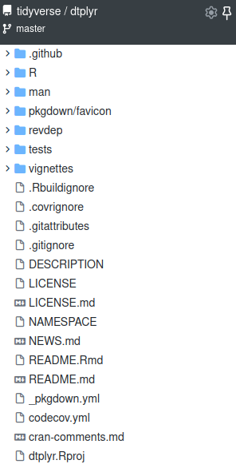

```{r xaringan-setup, echo=FALSE}
xaringanExtra::use_tile_view()
xaringanExtra::use_freezeframe()
xaringanExtra::use_clipboard()
xaringanExtra::use_broadcast()
```


```{r metathis, echo=FALSE}
# https://www.garrickadenbuie.com/blog/sharing-xaringan-slides/
library(metathis)
meta() %>%
  meta_name("github-repo" = "llrs/ghana_packages") %>% 
  meta_social(
    title = "Creating packages",
    description = paste(
      "Workshop about how to create packages",
      "For R User Group Gahna on the ."
    ),
    url = "https://ghana_packages.llrs.dev",
    image = "https://ghana_packages.llrs.dev/index_files/figure-html/title_slide_screenshot.png",
    image_alt = paste(
      "Image of the first slide for Reviewing packages; how does it work?", 
      ".", 
      "Done for the R User Group Ghana on 2021/09 by Lluís Revilla Sancho"
    ),
    og_type = "website",
    og_author = "Lluís Revilla Sancho",
    twitter_card_type = "summary_large_image",
    twitter_creator = "@Lluis_Revilla"
  )
```


# About 

.left[**myself**

I'm [Lluís Revilla Sancho](https://llrs.dev), a bioinformatician working on a research center of a hospital. 
Three packages on repositories: [BioCor](https://bioconductor.org/packages/BioCor/), [BaseSet](https://cran.r-project.org/package=BaseSet) and [experDesign](https://cran.r-project.org/package=experDesign).  
I have reviewed some packages on [rOpenSci](https://ropensci.org) and informally at [Bioconductor](https://bioconductor.org). 
]

.center[**you**


- ... know how to use R and write functions.  
- ... are using [RStudio IDE](https://www.rstudio.com/products/rstudio/download/).  
- ... have not created a package.  
- ... are using a computer with the latest [devtools](https://cran.r-project.org/package=devtools) installed.  
]

If you want to be sure run this code:

```r
if (!require("devtools", character.only = TRUE, quietly = TRUE)) {
  install.packages("devtools")
}
if (!require("covr", character.only = TRUE, quietly = TRUE)) {
  install.packages("covr")
}
```

???

[devtools](https://cran.r-project.org/package=devtools) is a package to help develop packages.
Currently many actions are done via [usethis](https://cran.r-project.org/package=usethis).
If you see something like `usethis::function` it means we call the `function` from usethis package. 

---
name:resources

# Resources 

- [R extensions](https://cran.r-project.org/doc/manuals/r-release/R-exts.html "Offical complete instructions"): Official documentation, everything is answered here
- [R packages](https://r-pkgs.org/ "R pakages"): A book more digestible and using other packages and tools to create packages.
- [Package primer](https://kbroman.org/pkg_primer/ "R package primer a minimal tutorial"): Website explaining different aspects of creating a package.
- [Creating R packages from scratch](https://hilaryparker.com/2014/04/29/writing-an-r-package-from-scratch/ "Creating a cats package"): Very easy to follow blog post.
- [Updated version by Tomas Westlake](https://r-mageddon.netlify.app/post/writing-an-r-package-from-scratch/ "Creating a cats package with usethis"): Similar to the post above but updated with more modern tools.
- [rOpenSci](https://devguide.ropensci.org/): A book  about writing packages and maintaining them on good shape.
- [Video](https://www.youtube.com/watch?v=IlWMkz769B4) with a similar workshop showing live the code used. 

Many resources!

You can also find help online (always check the etiquette)
- Asking your local community
- [Asking on Twitter #rstats](https://www.t4rstats.com/)
- [Asking on Stack Overflow](https://stackoverflow.com/questions/5963269)
- [Asking on Rstudio forum](https://community.rstudio.com/)

???

Resources used to create this workshop

[Maëlle post](https://masalmon.eu/2017/12/11/goodrpackages/): how to write good packages is also recommended.

---

## Example

.left-column[

```{r, echo=FALSE, out.width="100%", fig.alt="Tree view of the dtplyr package repository on 2021/08/06."}

```

]

.right-column[
- `.github` folder: Files specific to GitHub (this isn't necessary/[Advanced content](#advanced))
- A `R` folder with [*.R files](#r-files): your code.
- A `man` folder with [*.rd files](#rd-files): your documentation.
- A `tests` folder: [Check the code](#tests) of the package.
- A [`vignette` folder](#vignettes): Long documentation; not just examples.
- A `.Rbuildignore`: A file describing what to omit when building the package.
- A [`DESCRIPTION` file](#description): Summary and description of the package.
- A [`LICENSE` file](#licenses): The conditions under the package is released.
- A [`NAMESPACE` file](#namespace): What this package shares and needs.
- A [`NEWS` file](#news): What has changed since last release.
- A [`README`](#readme): How to install and why this packages is needed and some basic examples.
]

---


## Template

.pull-left[

```r
create_package("dogs")
```

It will create a dogs project within the directory and will open a new Rstudio window.

]

.pull-right[
- Creates DESCRIPTION file
- Creates R files
- Creates documentation files
- Creates NAMESPACE file
]

--

.pull-left[
Suggestions for packages:

- fruits
- cats
- food
- sports
- ...
]

.pull-right[


]
```{r countdown1, echo=FALSE}
countdown::countdown(minutes = 1, seconds = 30, top = 0, margin = "5%")
```


---
name: description

## DESCRIPTION

.pull-left[
```
Package: BaseSet
Title: Short Descriptiono in Title Case
Version: 0.0.9000
Authors@R: c(person(given = "Lluís",
             family = "Revilla Sancho",
             role = c("aut", "cre", "cph"),
             email = "lluis.revilla@gmail.com"),
             ...)
Description: A long description of the pacakge
License: MIT + file LICENSE
Depends: 
    R (>= 4.0.0)
Imports: 
    dplyr (>= 1.0.0),
    methods
Suggests: 
    covr,
    knitr,
    rmarkdown,
    spelling,
    testthat (>= 2.1.0)
VignetteBuilder: 
    knitr
Encoding: UTF-8
Language: en-US
Roxygen: list(markdown = TRUE)
RoxygenNote: 7.1.1
```
]

???
Name of the package, description of the package, maintainer, relationships with other packages...
Language does not need to be on English, it can be in other languages
--

.pull-right[
Modify the DESCRIPTION of your package. 

- Add a good title.
- Add a Description.
- Add yourself as an author.

```{r countdown2, echo=FALSE}
countdown::countdown(minutes = 3, top = 0)
```

]

---
name:r-files

## Add R files

On the new package R console run:

```r
usethis::use_r("dog_functions")
```

It will create a `dog_functions.R` file inside the R folder (and it will open it).

.center[

]

---

## Add R files

1. Only valid R code: functions, objects, environments that don't depend on previous code executed. 
2. If a function uses a function of an other package use `package::function`
    3. Add that package to the appropriate site on [Description](#description)
    4. add a `#' @importFrom package function` (See next slide)

```r
meow <- function() {
    message("meow")
}
```
```{r countdown2b, echo=FALSE}
countdown::countdown(minutes = 3, top = 0)
```

---
name:namespace
## NAMESPACE

Import code of other packages and export code of your package:

```r
import(dplyr)
importFrom(methods, is)
export(meow)
```

--

If using roxygen2 you can use:

```r
#' @import dplyr
#' @importFrom methods is
is_meow <- function(x){
    methods(x, "meow")
}

#' @export # To make it available to others
meow <- function() {
    message("meow")
} 
```

Which will be written to the NAMESPACE file when [updating the documentation](#rd-files)

???
Important file!

---
name:readme
## Documentation

### README

First page people might read if on Github or on a computer.

```r
usethis::use_readme_rmd() # build_readme()
```

Example README:
```{r data-table, echo=FALSE}

```

--

Modify README:

```{r countdown3, echo=FALSE}
countdown::countdown(minutes = 3, top = 0)
```
 

---
name:rd-files

## Documentation

### Function documentation

.pull-left[
Using [roxygen2](https://cran.r-project.org/package=roxygen2), example:

```r
#' Title
#'
#' Description
#' @param x 
#'
#' @return Values returned
#' @export
#'
#' @examples
#' a("hi")
a <- function(x) {
  print(x)
}
```
]

.pull-right[
Convert this specials comments into *.Rd files with:
```r
document()
```
]

???

In Rstudio you can insert the skeleton with <kbd>Ctrl</kbd>+<kbd>Alt</kbd>+<kbd>Shift</kbd>+<kbd>R</kbd> .
In Rstudio you can convert the special comments into documentation with <kbd>Ctrl</kbd>+<kbd>Shift</kbd>+<kbd>D</kbd> .

--

.center[Write your own documentation]

```{r countdown4, echo=FALSE}
countdown::countdown(minutes = 3, top = 0)
```


---
name: vignettes

## Documentation

### Vignettes

Long form of documentation, how multiple functions work together (It can use functions of other packages)

```r
usethis::use_vignette(name = "intro")
```

--

Write your own vignette:
- Fruits growing
- Dogs/cats exploring the house or the neighborhood
- A match of your sport
- ...

```{r countdown5, echo = FALSE}
countdown::countdown(minutes = 3, top = 0)
```


---
name: tests

## Tests

Make sure that what you think it happens it really stays that way:
Can be quite complicated

```r
use_testthat()
use_test("meow")
```

.pull-left[
Change from:

```r
test_that("multiplication works", {
  expect_equal(2 * 2, 4)
})

```
]

.pull-right[

To (**If** you used the [meow function](#namespace)): 
```r
test_that("mewo works", {
  expect_message(meow(), "meow")
})
```

]


--
```{r countdown6, echo=FALSE}
countdown::countdown(minutes = 3, top = 0)
```

---
name:licenses
## Licenses

If sharing the package what can people do with your package? 

- **Permissive** licenses: Code with a permissive license can be freely copied, modified, and published, and the only restriction is that the license must be preserved. 

- **Copyleft** licenses: if you publish modified versions or bundle with other code, the modified version or complete bundle must also be licensed with the same license.

```{r licenses, eval=FALSE}
usethis::use_mit_license() # Permissive
usethis::use_gpl_license() # Copyleft
usethis::use_proprietary_license() # Own license
```

.right[<sup>[Source](https://r-pkgs.org/license.html)</sup>]

???

---
name: news

## NEWS

Sharing what changed between releases

```r
usethis::use_news_md()
```

The file has this structure:

```raw
 # dogs 0.0.0.9000

 * Added a `NEWS.md` file to track changes to the package.

```

Version of the package

Text describing changes on the packages. 
It is a good place to acknowledge minor contributions

???
Modify to explain the changes.
Good idea to use - (#issue, `@user`)

--

```{r countdown7, echo=FALSE}
countdown::countdown(minutes = 3, top = 0)
```

---
## Finishing and checking

Check if everything works well! It can take some time.

```r
check()
```

It should pass without Warnings or Errors. 
If not (most probable) fix the problems found 

???
Automatically runs the test and checks the package compilance with common quality standards

---

## That's all


.center[

]

---

## Developing your package

- [Modify or add](#r-files) more *.R files to the R folder
- [Add or change function's documentation](#rd-files) and [vignettes](#vignettes) and update it (`document()`)
- Check the package (`check()`)
- Repeat.

---
## Questions, doubts, comments?

- It is normal to not succeed on the first 5-10 attempts!!
- Search, ask whenever you need.

Thanks for following through it.


???

---
name:advanced
# Advanced

## Git

Set up git as a control version system. This allows to share on [GitHub](https://github.com).
To set it up use:

```{r git, eval=FALSE}
usethis::use_git()
```

???
Version controls helps you to modify code securely and interact with others (and receive their suggestions). 


---
# Advanced
## Github

Share the package on Github:

```{r github, eval=FALSE}
usethis::use_github()
```

Add checks

```{r github-action, eval=FALSE}
usethis::use_github_action_check_release()
```

Use the git panel of Rstudio to commit and push updates on the package. 

???

Having a package public on github can help on your CV and to get users. 

---
# Advanced
## Code coverage

Report how much of the package is tested.

```{r coverage, eval=FALSE}
usethis::use_coverage()
```

It can be done offline on your computer `covr::report()` but usually also reported online. 

???
Aim to have high code coverage (above 75%). 
High code coverage prevents your users (and yourself) to push changes that do not work. 


---
# Advanced
## Pkgdown website

Now that the package is working and public, a website makes it easier for users to find documentation.

```{r pkgdown, eval=FALSE}
usethis::use_pkgdown()
usethis::use_pkgdown_github_pages()
```

???

It is also great for publicity, so others can read and learn about your package without installing it. 
